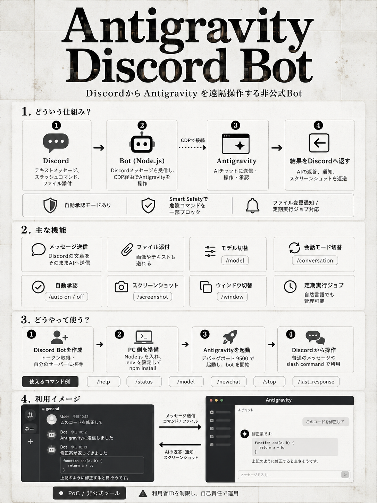
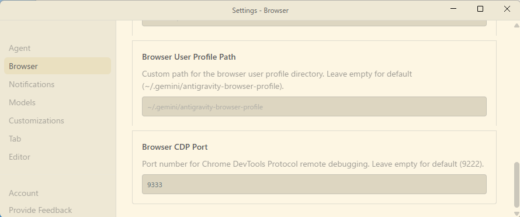

<div align="center">


# Antigravity Discord Bot


</div>



このツールはAntigravity (VS Code Fork) を Discord から操作するためのボットです。
Chrome DevTools Protocol (CDP) を使用して Antigravity の内部状態にアクセスし、メッセージの送信や操作の自動化を行います。
> ※ 本ツールは公式のAntigravityとは無関係の非公式ツールです。

> [!CAUTION]
> **【重要】セキュリティに関する警告 / Security Warning**
> 
> このソフトウェアは開発者向けの実験的ツール (PoC) です。仕組み上、**あなたのPCを外部（Discord）から遠隔操作するバックドア**として機能します。Botの操作権限を奪われることは **PCの乗っ取りと同義** です。
> 
> **自動承認モード (Auto-approval)** を有効にした場合、Antigravityが求めるすべての操作許可を**無条件・無検閲で自動承認**します。AIが破壊的な操作（ファイル全削除、APIキーの外部送信、悪意あるコマンド実行など）を提案しても、確認なしに即座に実行されます。v1.3のSmart Safetyは一部の危険なコマンドをブロックしますが、**すべてを検出できるわけではありません。**
>
> **安全に使うための絶対ルール:**
> 1. **`.env`（Botトークン）を絶対に公開しない** — パスワードと同じです
> 2. **`DISCORD_ALLOWED_USER_ID` を自分だけに厳格に制限する** — 設定ミス＝第三者にPCを操作される危険
> 3. **個人情報のない独立した環境（仮想環境等）で使用する** — メインPCでの利用は非推奨
> 4. **自動承認モードを使用する場合は、事前にバックアップを取ること**
> 5. **本番環境・顧客データがある環境では絶対に使用しない**
> 6. **セキュリティの知識がない一般ユーザーへの配布は非推奨**
>
> **本ツールの使用によって生じたいかなる損害（データ喪失、システム破壊、情報の流出等）についても、開発者は一切の責任を負いません。すべて自己責任で使用してください。** 詳細は [DISCLAIMER.md](DISCLAIMER.md) を参照。
>
> [!WARNING]
> **アカウント停止のリスクについて / Terms of Service & Account Risk**
> 
> 本ツールは Google Antigravity の非公式な自動化ツールです。
> 
> **規約違反と判断された場合、該当の Google アカウントが予告なく一時停止、または永久的に削除（BAN）されるリスクがあります。**
> **万が一アカウントが停止されても支障のない環境での利用を推奨します。**

> [!TIP]
> **許可ボタンの自動クリック機能について**
> v1.2より、AIエージェントが実行する「Run」や「Allow Once」といった承認ボタンを自動でクリックする **「自動承認モード (Auto-approval mode)」** が搭載されました。以下のDiscordコマンドで制御可能です。
>
> v1.3では、Discord上のボタンがAntigravity側のボタン名（Run, Allow Onceなど）をそのまま反映するようになりました。また、`rm -rf /` 等の危険なコマンドは自動承認モードでもブロックされ、手動承認が求められます。
>
> なお、本Botの自動承認機能はまだ動作が安定しない場合があります。より確実な自動承認を求める場合は、Antigravity拡張機能の **[Antigravity Auto Accept (pesosz)](https://open-vsx.org/extension/pesosz/antigravity-auto-accept)** の利用をおすすめします。v1.7.2以降はデバッグポートが `9500` に変更されているため、拡張機能のコントロールパネルでCDPポートを `9500` に設定してください。

## おすすめの導入方法

antigravityのAIチャットに以下のプロンプトを入力してください。
「https://github.com/harunamitrader/antigravity-discord-bot を導入して。可能な範囲でAI側で作業を行い、必要な情報があれば質問して。手動で行う必要があるものは丁寧にやり方を教えて。」

導入が完了したら、
「デバッグモード用ショートカットとantigravity-discord-botの起動用ショートカットをデスクトップに作成して」
も必要に応じてプロンプトを送信しても良いかもしれません。

## ⏰ 定期実行ジョブ（Scheduled Jobs）

Botに定期的なタスクを実行させる機能です。ジョブは `data/jobs/*.json` に1ジョブ1ファイルで保存され、Botがファイルの変更をリアルタイムで検知します（**Bot再起動不要**）。

Antigravity（AIチャット）から自然言語でジョブを管理できるスキルを同梱しています。

### セットアップ

#### 1. グローバルスキルのインストール

以下のプロンプトをAntigravityのチャットに貼り付けて実行してください。スキルがグローバルスキルとして配置され、どのプロジェクトを開いていてもジョブ管理できるようになります。

```
antigravity-discord-botのリポジトリにある .agent/skills/schedule-manager/ ディレクトリを
~/.gemini/antigravity/skills/schedule-manager/ にコピーして、グローバルスキルとしてインストールしてください。
コピー後、~/.gemini/antigravity/skills/schedule-manager/SKILL.md の内容を読んで、
ジョブ管理の方法を把握したと一言報告してください。
```

#### 2. ジョブの保存場所

```
antigravity-discord-bot/
  data/
    jobs/
      github-trend-daily.json   ← 1ジョブ = 1ファイル
      ai-monitor-weekly.json
      ...
```

Botは `data/jobs/` ディレクトリを [Chokidar](https://github.com/paulmillr/chokidar) で監視しています。ファイルの追加・変更・削除を検知すると、自動で cron タスクを登録・更新・停止します。

### ジョブファイルの仕様

各ファイルは以下の形式の JSON です。ファイル名（拡張子なし）がジョブ名になります。

```json
{
  "cron": "0 9 * * *",
  "message": "GitHubトレンド記事を作成して",
  "active": true
}
```

| フィールド | 型 | 説明 |
|---|---|---|
| `cron` | string | 5フィールドのcron式。**タイムゾーンは JST (Asia/Tokyo)**。必須。 |
| `message` | string | 定期実行時にAntigravityの現在のセッションに送信されるメッセージ。必須。 |
| `active` | boolean | `true` で有効、`false` で一時停止（ファイルは残る）。省略時は `true`。 |

### cron 式の書き方

```
 ┌──── 分 (0-59)
 │ ┌──── 時 (0-23)
 │ │ ┌──── 日 (1-31)
 │ │ │ ┌──── 月 (1-12)
 │ │ │ │ ┌──── 曜日 (0-7, 0と7=日曜)
 │ │ │ │ │
 * * * * *
```

| 式 | 意味 |
|---|---|
| `0 9 * * *` | 毎日 9:00 |
| `30 8 * * 1-5` | 平日 8:30 |
| `0 */2 * * *` | 2時間おき |
| `*/30 * * * *` | 30分おき |
| `0 9 * * 1` | 毎週月曜 9:00 |
| `0 9 1 * *` | 毎月1日 9:00 |

### ジョブの管理方法

#### Antigravity（AI）で管理する場合（推奨）

グローバルスキルをインストール済みであれば、Antigravityに話しかけるだけで管理できます：

- **追加**: 「毎日9時にGitHubトレンド記事を作成するジョブを追加して」
- **一覧**: 「スケジュールされているジョブを一覧表示して」
- **変更**: 「github-trend-daily のジョブを2時間おきに変更して」
- **停止**: 「github-trend-daily のジョブを一時停止して」
- **削除**: 「github-trend-daily のジョブを削除して」

#### 手動で管理する場合

`data/jobs/` に直接 JSON ファイルを作成・編集・削除するだけです。Botが自動検知します。

```bash
# 追加
echo '{"cron":"0 9 * * *","message":"Hello","active":true}' > data/jobs/hello.json

# 一時停止（active を false に変更）

# 削除
rm data/jobs/hello.json
```

### 動作の仕組み

1. cron 式の時刻（JST）になると、Botが `message` の内容を **現在開いているAntigravityのセッション** にCDP経由で送信します
2. 送信と同時に、Discordチャンネルに「⏰ Job: `メッセージ内容`」という通知が送られます
3. Antigravityの応答はDiscordにリレーされます（通常のメッセージ送信時と同じ動作）
4. Bot起動時に `data/jobs/` 内の全ジョブが自動復元されます

## 🚀 主な機能

1.  **テキスト生成**: DiscordメッセージをそのままAntigravityに転送し、生成を開始します。
2.  **ファイル添付**: 画像やテキストファイルを添付してAntigravityに送信できます。
3.  **モデル切替**: `/model` コマンドでAIモデルを切り替えられます。
4.  **モード切替**: `/conversation` コマンドでPlanning/Fastモードを切り替えられます。
5.  **自動承認**: `/auto` コマンドで承認ボタンの自動クリックをON/OFFできます。
6.  **動的ボタンラベル**: Discord上の承認ボタンがAntigravity側のラベル（Run, Allow Once等）を反映します。
7.  **Smart Safety**: 自動承認モードでも破壊的コマンド（`rm -rf /` 等）を検出し、手動承認を要求します。
8.  **スクリーンショット**: `/screenshot` コマンドで現在の画面を取得できます。
9.  **生成停止**: `/stop` コマンドで生成を中断できます。
10. **新規チャット**: `/newchat` コマンドで新しい会話を開始できます。
11. **最終レスポンス取得**: `/last_response` コマンドで直前のAI回答を再取得できます。
12. **ファイル監視**: プロジェクトディレクトリ内のファイル変更を検知し、Discordに通知します。
13. **ウィンドウ管理**: `/window` コマンドで現在の接続先ウィンドウの確認や切り替えができます。
14. **Bot再起動**: `/restart` コマンドでBotプロセスを再起動できます（`start_bot.bat` 経由で起動している場合）。
15. **起動完了通知**: Bot起動完了時にDiscordへ通知メッセージを送信します。
16. **チャンネル指定**: チャット通知とファイルログ通知の送信先チャンネルを `.env` で個別に指定できます（オプション）。
17. **定期実行ジョブ**: `data/jobs/*.json` にジョブファイルを配置することで定期実行が可能。Antigravityのチャットから自然言語で管理できます。ファイル変更をリアルタイム検知（Bot再起動不要）。

## 🛠️ 事前準備 (Discord Botの作成)

### 1. Discord Botの作成とトークン取得
1. [Discord Developer Portal](https://discord.com/developers/applications) にアクセスし、ログインします。
2. 右上の **"New Application"** をクリックし、名前（例: `AntigravityBot`）を入力して作成します。
3. 左メニューの **"Bot"** を選択し、**"Reset Token"** をクリックしてトークンを生成・コピーします。
   - ※このトークンが `.env` の `DISCORD_BOT_TOKEN` になります。
4. 同ページ（Botタブ）の下部にある **"Privileged Gateway Intents"** セクションで、以下を **ON** にします。
   - **PRESENCE INTENT**
   - **SERVER MEMBERS INTENT**
   - **MESSAGE CONTENT INTENT** (重要: これがないとメッセージを読み取れません)
5. 設定を変更したら必ず **Warning: Save Changes** ボタンで保存してください。

### 2. Botをサーバーに招待
1. 左メニューの **"OAuth2"** -> **"URL Generator"** を選択します。
2. **SCOPES** で `bot` にチェックを入れます。
3. **BOT PERMISSIONS** で以下にチェックを入れます（最低限必要な権限）。
   - Read Messages/View Channels
   - Send Messages
   - Send Messages in Threads
   - Embed Links
   - Attach Files
   - Read Message History
4. 生成されたURLをコピーし、ブラウザで開いてBotを自分のサーバーに追加します。

### 3. DiscordユーザーIDの取得
1. Discordアプリの **「ユーザー設定」** (歯車アイコン) -> **「詳細設定」** を開きます。
2. **「開発者モード」** をオンにします。
3. 自分のユーザーアイコンまたは名前を右クリックし、**「ユーザーIDをコピー」** を選択します。
   - ※このIDが `.env` の `DISCORD_ALLOWED_USER_ID` になります。

## 📦 導入方法

### 必要要件
- Node.js (v18以上推奨)
- Antigravity (デバッグポートを指定して起動していること。**v1.7.2以降のデフォルトは `9500`**)

### インストール手順

1. リポジトリをクローンします。
   ```bash
   git clone https://github.com/harunamitrader/antigravity-discord-bot.git
   cd antigravity-discord-bot
   ```

2. 依存パッケージをインストールします。
   ```bash
   npm install
   ```

3. 環境変数を設定します。
   リポジトリに含まれる `.env.example` をコピーして `.env` という名前で保存し、中身を書き換えてください。
   
   **Windows (PowerShell):**
   ```powershell
   cp .env.example .env
   ```
   **Mac/Linux:**
   ```bash
   cp .env.example .env
   ```

   その後、`.env` ファイルを開き、トークンなどを入力します。

### 起動方法

1. **Antigravityをデバッグモードで起動**
   - Antigravityのショートカットをコピーして作成します。
   - ショートカットを右クリックし、**「プロパティ」** を開きます。
   - **「リンク先」** の末尾に半角スペースを入れて `--remote-debugging-port=9500` を追加します。
     - 例: `"C:\...\Antigravity.exe" --remote-debugging-port=9500`
   - 「OK」を押して保存し、そのショートカットからアプリを起動します。

   > [!WARNING]
   > **【v1.7.1以前のユーザー向け】AntigravityのBrowser CDP Portを変更してください**
   >
   > ⚠️ **v1.7.2以降はデバッグポートが `9500` に変更されたため、この設定は不要になりました。**
   > 新規インストールの場合は、この手順をスキップしてください。
   >
   > ---
   >
   > **（以下、v1.7.1以前をお使いの方向けの情報）**
   >
   > v1.7.1以前では、BotのデバッグポートはデフォルトでAntigravityのブラウザツール機能と同じ **ポート9222** を使用していたため、**ブラウザツールがAntigravityのメインウィンドウに誤接続し、ウィンドウが乗っ取られる**バグが発生していました。
   >
   > 旧バージョンを使用する場合の回避策: Antigravity → Settings → Browser → **Browser CDP Port** を `9333` 等に変更
   >
   > 
   >
   > | 項目 | v1.7.1以前 | v1.7.2以降 |
   > |---|---|---|
   > | Antigravityデバッグポート（ショートカット） | `9222` | **`9500`**（変更済み）|
   > | Antigravity設定 > Browser CDP Port | `9333`（要手動変更）| 変更不要 |

2. **ボットを起動**
   ```bash
   node discord_bot.js
   ```
   または `start_bot.bat` をダブルクリックして起動（`/restart` コマンドによる自動再起動に対応）。

### 🔌 高度な設定: 複数ウィンドウでのマルチタスク (Multi-Instance Support)

同じPCで複数のAntigravityウィンドウを立ち上げ、別々のBotアカウントで独立して遠隔操作することができます。

#### 1. 設定の準備
リポジトリにある `.env.bot2.example` をコピーして **`.env.bot2`** を作成し、中身を **2つ目のBotのトークン** に書き換えます。

#### 2. 起動手順
ターミナルを2つ開くか、`start_bot.bat` を2回起動します。
- **1つ目のプロセス** は自動的に `.env` を読み込んで起動します。
- **2つ目のプロセス** は、すでに1つ目が動いていることを検知し、自動的に `.env.bot2` にフォールバックして2番目のBotとして起動します。

#### 3. ウィンドウの割り当て
Discord上で、それぞれのBotが存在するチャンネルで以下のコマンドを入力します。
```text
/window
```
表示される接続先候補のリストから、Bot 1にはウィンドウAの番号を、Bot 2にはウィンドウBの番号を指定して割り当てます。
これで、1台のPCで2つの画面を2つのBotに個別にマルチタスクさせることができます。

## 📖 コマンド一覧

| コマンド | 説明 |
|---|---|
| `/help` | コマンド一覧と使い方の表示 |
| `/status` | ウィンドウ、モデル、モード、自動承認の状態を表示 |
| `/auto on` / `/auto off` | 自動承認をON/OFFに切り替え |
| `/model` | 利用可能なモデル一覧を表示 |
| `/model number:<番号>` | 指定したモデルに切り替える |
| `/conversation planning` / `/conversation fast` | モードを切り替える |
| `/newchat` | 新しいチャットを開始 |
| `/stop` | 生成を停止 |
| `/screenshot` | スクリーンショットを取得 |
| `/last_response` | 直前のAI回答を再取得 |
| `/window` | 出力可能なウィンドウの一覧を表示 |
| `/window number:<番号>` | 指定したウィンドウに切り替える |
| `/restart` | Botプロセスを再起動（`start_bot.bat` 経由起動時のみ自動再起動） |

## 🛠️ 技術仕様

詳細な仕様については [SPECIFICATION.md](SPECIFICATION.md) を参照してください。

## 📝 変更履歴

詳細な変更履歴については [CHANGELOG.md](CHANGELOG.md) を参照してください。

## ⚖️ 免責事項

本ソフトウェアの使用に関する免責事項・セキュリティ警告の詳細は [DISCLAIMER.md](DISCLAIMER.md) を参照してください。

## 📜 ライセンス

MIT License — 詳細は [LICENSE](LICENSE) を参照してください。
